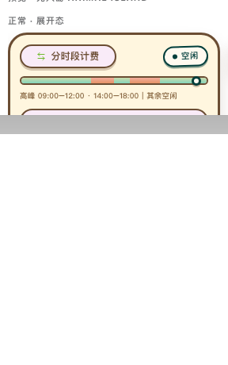

# DeepSeek Peak & Off-Peak Pricing + Go Plan Usage Widget

**v0.2.0** · A DSH Web sidebar plugin

[](#) [](#) [](#)

## In one sentence

It lives in the DSH Web left sidebar and keeps an eye on two things for you: **whether DeepSeek is currently in a peak or off-peak window**, and **how much of your Go plan quota you have used**.

## What it does

- **Detects the window automatically**: in Beijing time it recognises peak (09:00–12:00, 14:00–18:00) and off-peak windows; the peak rate is 2× the off-peak rate.
- **Always in the sidebar**: rates and the current window are visible in the left bar without opening a page, and the details expand in place.
- **11 skins**: dark tech, minimal, receipt, metro line, terminal, and more — pick whichever you like.
- **Go plan quota**: shows the Go model's usage over the last 5 hours, this week, and this month.
- **Follows your language**: all copy comes from the official DSH locale layer, so it switches with **Settings → General → Language** (English and Chinese dictionaries are both shipped).

> Prices are a UI demonstration based on published rates (DeepSeek V4, CNY / million tokens). Live figures depend on the official real-time API.

## What's new (v0.2.0)

1. **New "Go 5h usage" bar** (skins 1–10): a **plain progress bar with no peak/off-peak markers** below the timeline, dedicated to the Go model's usage percentage over the last 5 hours.
2. **Rebuilt balance panel**:
   - the old "Granted / Topped up / Available" trio is gone (rarely useful day to day);
   - replaced by **Go weekly quota** and **Go monthly quota** (with percentages and amounts);
   - the footer is no longer static text but a **real 60-second countdown** — on reaching zero it refreshes the data once and starts over.
3. **Fixed the CNY balance**: it used to render as `0.00 USD` (it picked the wrong account entry). It now shows **your actual CNY balance**, e.g. `90.xx CNY`.
4. The title changed from "DeepSeek pricing" to **"DeepSeek & Go"**.

> Note: skin 11 (Animal Island) is a dual-view design with its own three Go-quota stickers; it does not use the 1–10 progress-bar change above.

## Eleven skins

Each skin has both an **expanded** and a **collapsed** form (real screenshots):

| | | | | | |
|---|---|---|---|---|---|
| **01 · Pulse** | **02 · Minimal** | **03 · Receipt** | **04 · Metro** | **05 · Pills** | **06 · Terminal** |
|  |  |  |  |  |  |
| **07 · Brutalist** | **08 · Glass** | **09 · DayNight** | **10 · Editorial** | **11 · Animal Island** | |
|  |  |  |  |  | |

Want to flip through each skin's peak/off-peak appearance? Open the design sheet directly in a browser:
[`deepseek-pricing-widget-styles.html`](deepseek-pricing-widget-styles.html) (the simulated window can be switched in the top-right corner);
dual-view design sheet: [`animal-island-widgets-v2.html`](animal-island-widgets-v2.html).

## Installation

```sh
dsh plugin --profile web add /path/to/dsh-deepseek-peak-valley
```

Restart `dsh web` afterwards.

## Language

The plugin registers its own namespace (`dsh-deepseek-peak-valley`) with the official
[`@deepseek-ai/dsh-client-locale`](https://www.npmjs.com/package/@deepseek-ai/dsh-client-locale) service
and takes the framework-synthesised `t` seat on both of
its slots. There is nothing to configure per plugin: copying follows the global
**Settings → General → Language** choice, and switching it updates the sidebar widget, the settings page,
and the host error messages immediately.

Chinese and English dictionaries are both shipped, and the typed registration makes them
compile-checked against one key union — a missing or extra key fails the build.

## Keys

The settings page takes an optional OpenCode Go key and DeepSeek key. They are used to fill the
Go-quota stickers and the balance panel; leave them blank to fall back to what the system already has
(`auth.json` or environment variables). Saved keys live only in
`~/.dsh/dsh-deepseek-peak-valley.json`.

## Compatibility

- Target: **DSH Web · rc.8**
- Appears in: bottom-left of the left sidebar (above the settings button) + a "DeepSeek Peak & Off-Peak" page under Settings (enable/disable, skin switching)

## License

[MIT](LICENSE) © 2025 z-col
