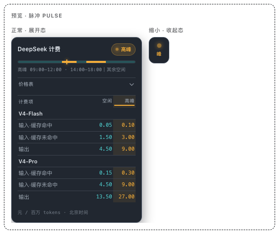
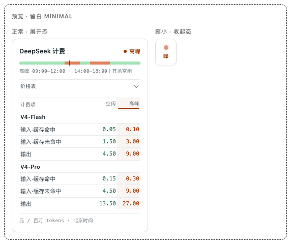
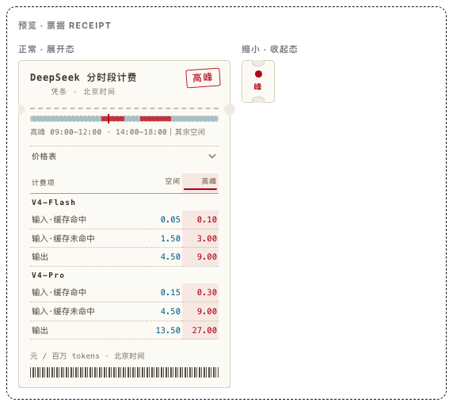
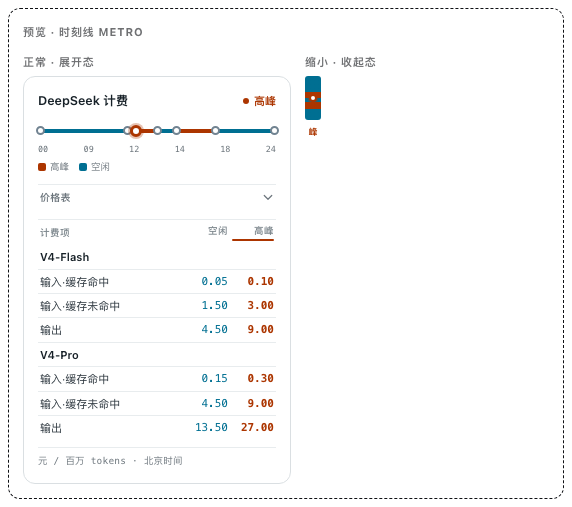
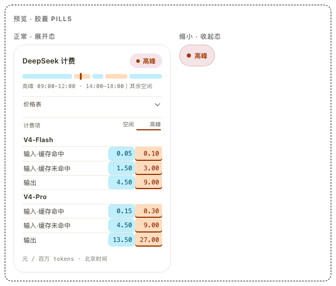
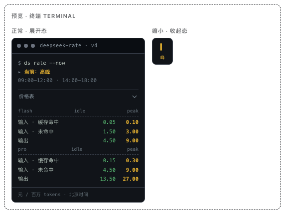
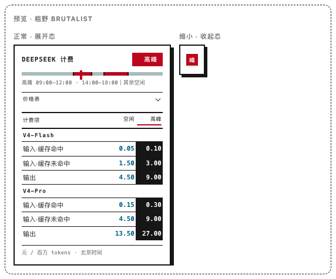
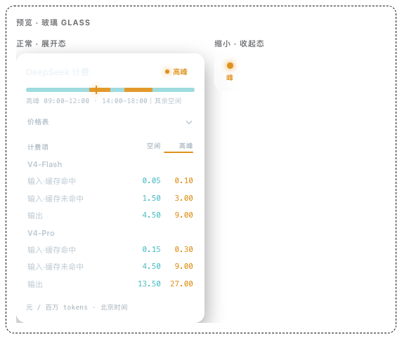
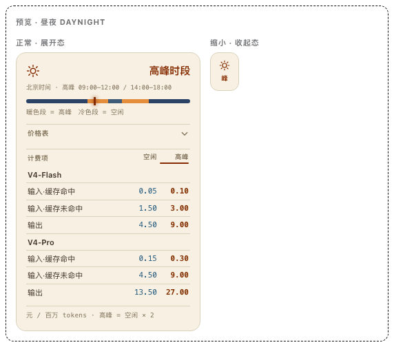
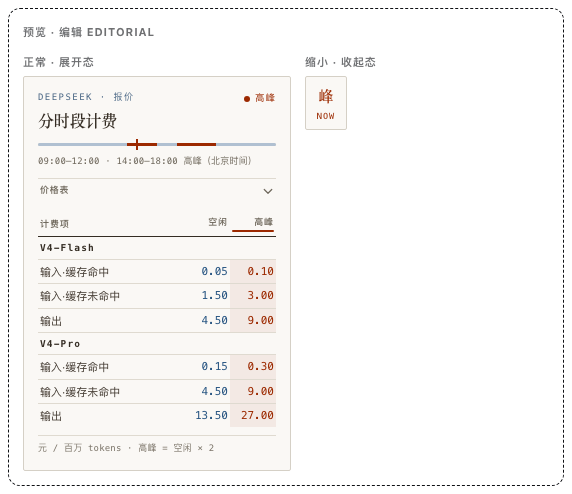

# dsh-deepseek-peak-valley

**v0.1.0** · DeepSeek 分时段计费小组件 · DSH client 插件（platform=web）

[](#) [](#) [](#) · `sidebar.footer.action` · `settings.section`

按北京时间自动判定高峰（09:00–12:00、14:00–18:00）/ 空闲时段，在 DSH Web
左侧边栏左下角（设置上方）展示分时段计费报价；支持 **10 款风格切换** 与启停开关（设置页「DS峰谷小组件」）。

> 价格基于公开报价（ DeepSeek V4，元 / 百万 tokens），仅作界面演示；
> 正式接入请以官方实时接口为准。

---

## 兼容性（DSH 版本标识）

- 插件目标：**DSH Web · rc.8**（`@deepseek-ai/dsh-client-runtime` / `-ui-sidebar` / `-ui-settings` / `-ui-slots` 均 `^0.1.0-rc.8`，`@deepseek-ai/cordis ^4.0.1`）
- 挂载形态：`sidebar.footer.action`（展开=完整报价 / 收起=紧凑指示器）+ `settings.section`（设置页）
- 发布：[GitHub Releases](https://github.com/z-col/dsh-deepseek-peak-valley/releases)（当前 v0.1.0）

## 🎨 十款风格预览

每款风格包含**正常（展开态）**与**缩小（收起态）**两种形态（真实运行截图）：

| | | | | |
|---|---|---|---|---|
| **01 · 脉冲 Pulse**<br>深色科技 | **02 · 留白 Minimal**<br>极简浅色 | **03 · 票据 Receipt**<br>票根 | **04 · 时刻线 Metro**<br>线路图 | **05 · 胶囊 Pills**<br>圆润亲和 |
|  |  |  |  |  |
| **06 · 终端 Terminal**<br>CLI 日志 | **07 · 粗野 Brutalist**<br>硬边高对比 | **08 · 玻璃 Glass**<br>毛玻璃 | **09 · 昼夜 DayNight**<br>明暗随时段 | **10 · 编辑 Editorial**<br>杂志 |
|  |  |  |  |  |

> 想交互式切换查看每款风格的高峰/空闲表现？打开设计稿预览页：
> [`deepseek-pricing-widget-styles.html`](deepseek-pricing-widget-styles.html)（浏览器直接打开，右上角可切换模拟时段）。

---

## 安装（已验证命令）

```sh
# scratch profile 验证
dsh plugin --profile ds-pv-scratch add /path/to/dsh-deepseek-peak-valley

# 装入 web profile（装后需重启 dsh web）
dsh plugin --profile web add /path/to/dsh-deepseek-peak-valley
```

## 开发

```sh
pnpm typecheck   # host + client 双 program
pnpm build       # lib/index.js + lib/client.js（__ModuleLoader__ 包装）+ lib/types
pnpm watch       # client HMR 需 tsdown --watch 持续重写 lib/client.js
```

## 契约

- 挂载：`sidebar.footer.action`（owner `{ wide }`：展开=完整报价 / 收起=紧凑指示器）
- 设置：`settings.section`「DS峰谷小组件」（启停 + 10 款风格切换 + 模拟时段 + 预览）
- 时段规则（北京时间）：高峰 09:00–12:00 / 14:00–18:00，其余空闲；高峰价 = 空闲 × 2

## License

[MIT](LICENSE) © 2025 z-col
